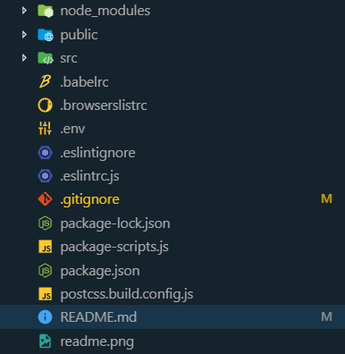

# DevEnvironment

## You can use it for

- Static pages
  - React (optional)
  - Vue (still on development)
- Node.js
  - API
  - Web Server
  - CLI
- Node.js API serving static pages using React (optional)

## Easy Guide

Download by order

- [VSCode]
- [Settings Sync]

In **VSCode**

- Press F1 and go to

  - 'Sync: Advanced Options'
  - 'Download settings from public Gist'

- Press F1 again and go to
  - 'Sync: Download settings'
  - Write this code **`6f8c59082e58b005f1dd38a7236eeeaf`**

**Now just download the boilerplate code you wish to use!**

- Open terminal on the root directory and write:
  - `npm install`
- For the instructions write on the terminal:
  - `npm start help`

**It's done!**

You will see a similar file structure to this one depending on the project you choose!

## Guide

### For a more advanced user

- Make sure you have **EsLint** installed in your Code Editor
- Enable `eslint.autoFixOnSave`

**Note:**
If you have **prettier** installed in your code editor then disable it for **Javascript**

- `"prettier.disableLanguages": ["javascript"]`

## Development setup

**Depending on the boilerplate project you choose you will have some or all of these options**

To run any of these commands write `npm start` followed by:

- `help` - See all commands available for current project
- `build` - Build Node or DOM or both projects for production
- `node` - Development mode for Node.js
- `node.build` - Build Node.js project
- `node.build.run` - Build Node.js project and run server
- `node.test` - Mocha test
- `node.test.watch` - Mocha test watcher
- `node.debug` - Debug Node.js project
- `dom` - Development mode for DOM
- `dom.build` - Build DOM project
- `dom.build.run` - Build DOM project and run server
- `localTunnel` - Expose localhost port 3000
- `update` - Package interactive updater

Example: `npm start node`

<!-- _For more examples and usage, please refer to the [Wiki][wiki]._ -->

## Usage

You can code normally as you would in any project with some aditions

- Babel
- Imports
  - `import './example.js'` Import a whole file
  - `import exported_data from './example.js'` Import exported objects, functions or primitive values
  - `export default exported_data` Export statement
  - For more info on imports and exports [click here][import-export]
- View Libraries
  - [React.js]
- Stylesheets
  - [SASS]
  - [CSS-Nano]
  - [Autoprefixer]
  - Import the compiled sass file in your JS file like this `import './style.css'`
  - For more info on the sass syntax [click here][sass-guide]
- Formatting and linting
  - [EsLint]
    - Google Config
    - Functional Programming config
    - Prettier config
  - [Prettier]
- Web Server
  - [Express.js]
  - [BrowserSync]
  - [LocalTunnel] for exposing localhost online
- Testing
  - [Mocha]
  - [Expect]
  - [Supertest]
- Utils
  - [Nodemon]
  - [DotEnv]
  - [Chalk]

## Release History

- 1.0.0 :
  - Organized code and added comments for public
  - Added NPS for better npm scripts management

## Meta

[Anthony White] – me@anthonywhite.eu

Distributed under the XYZ license. See `LICENSE` for more information.

[https://github.com/yourname/github-link](https://github.com/dbader/)

## Contributing

1. Fork it (<https://github.com/AnthonySLWhite/DevEnvironment/fork>)
2. Create your feature branch (`git checkout -b feature/fooBar`)
3. Commit your changes (`git commit -am 'Add some fooBar'`)
4. Push to the branch (`git push origin feature/fooBar`)
5. Create a new Pull Request

<!-- Markdown link & img dfn's -->

[settings sync]: https://marketplace.visualstudio.com/items?itemName=Shan.code-settings-sync
[vscode]: https://code.visualstudio.com/
[import-export]: https://hackernoon.com/import-export-default-require-commandjs-javascript-nodejs-es6-vs-cheatsheet-different-tutorial-example-5a321738b50f
[react.js]: https://reactjs.org/
[sass]: https://sass-lang.com
[autoprefixer]: https://github.com/postcss/autoprefixer#readme
[css-nano]: https://github.com/cssnano/cssnano
[sass-guide]: https://sass-lang.com/guide
[eslint]: https://eslint.org/
[prettier]: https://prettier.io/
[express.js]: http://expressjs.com/
[browsersync]: https://www.browsersync.io/
[localtunnel]: https://localtunnel.github.io/www/
[mocha]: https://mochajs.org/
[expect]: https://devhints.io/expectjs
[supertest]: https://github.com/visionmedia/supertest#readme
[nodemon]: https://nodemon.io/
[dotenv]: https://github.com/motdotla/dotenv#readme
[chalk]: https://github.com/chalk/chalk#readme
[wiki]: https://github.com/yourname/yourproject/wiki
[anthony white]: https://anthonywhite.eu
